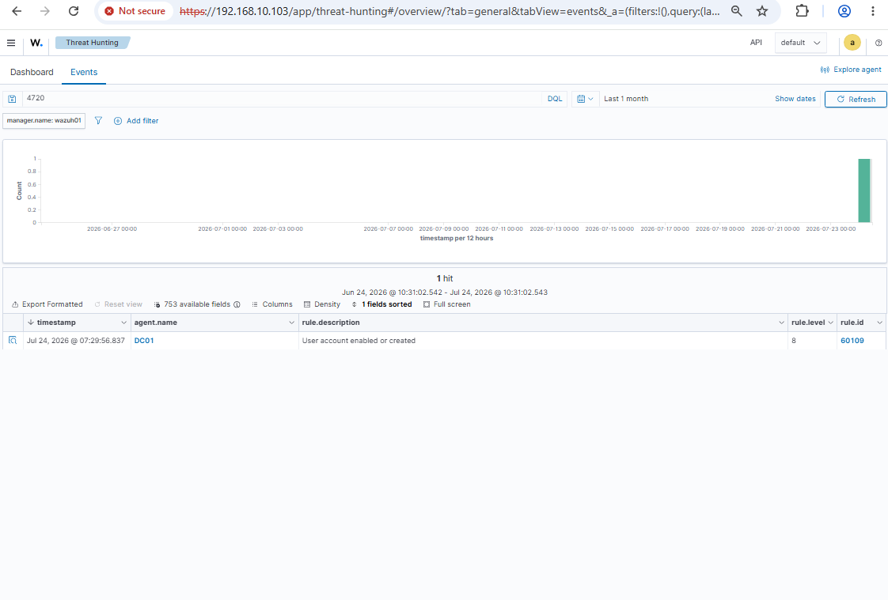
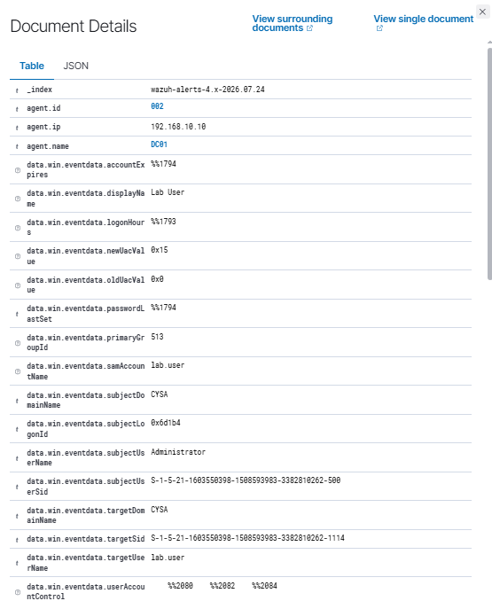
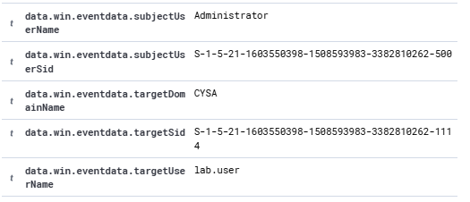
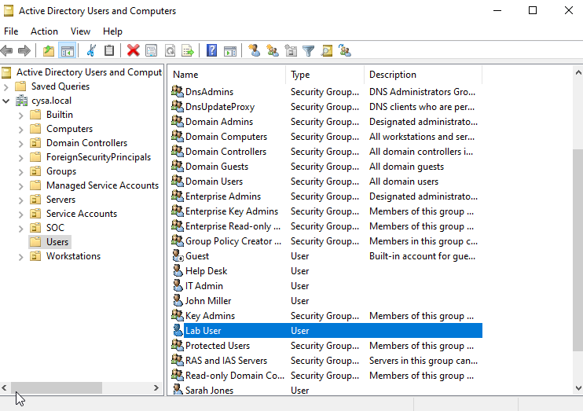
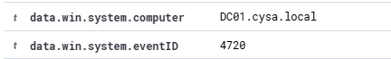

# SOC Lab 02 – Windows User Account Investigation

## Objective

Investigate a Windows Security Event (Event ID 4720) generated when a new Active Directory user account was created and verify whether the activity was legitimate or suspicious.

---

## Lab Environment

- Wazuh SIEM v4.14.6
- Windows Server 2022 Domain Controller
- Active Directory
- Windows 10 Workstation
- VirtualBox
- MITRE ATT&CK Framework

---

## Attack Scenario

As part of a simulated SOC investigation, a new Active Directory user account was intentionally created on the domain controller. Wazuh detected Windows Security Event ID 4720, and the investigation focused on identifying who created the account, verifying the account in Active Directory, and determining whether the activity was authorized.

---

## Investigation Process

1. Searched Wazuh for Event ID 4720.
2. Opened the event details.
3. Identified the Subject User Name (Administrator).
4. Verified the Target User Name (lab.user).
5. Confirmed the account existed in Active Directory.
6. Reviewed the event source, computer name, and timestamp.

---

## Findings

- Windows Security Event ID 4720 was detected.
- Administrator created the account **lab.user**.
- The account was successfully verified in Active Directory.
- The activity matched the expected lab scenario and was authorized.

---

## MITRE ATT&CK

**Technique**

- T1136 – Create Account

**Tactic**

- Persistence

---

## Investigation Screenshots

### 1. Wazuh Search Results

### 2. Event Details

### 3. User Creation Fields

### 4. Active Directory Verification

### 5. Event Source

### 6. Event Timestamp

---

## Skills Demonstrated

- SIEM Investigation
- Windows Event Log Analysis
- Active Directory Investigation
- Log Correlation
- MITRE ATT&CK Mapping
- Incident Documentation

---

## Outcome

Successfully investigated and documented a Windows user account creation event using Wazuh and Active Directory. The investigation confirmed the activity was legitimate administrative behavior and demonstrated the process of validating Windows security events in a SOC environment.
