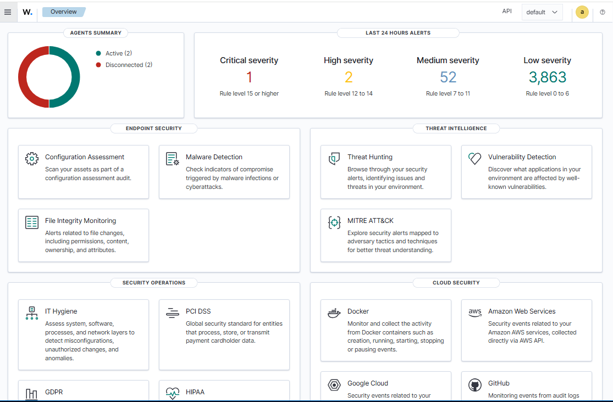
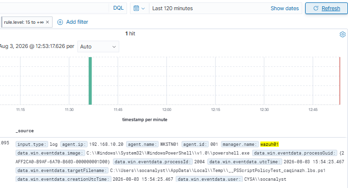
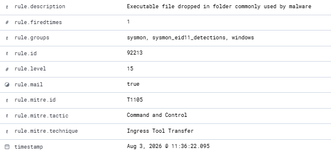
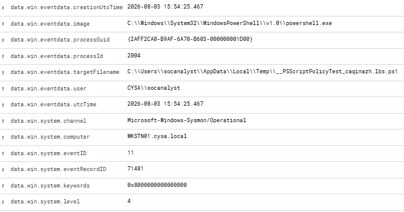

# Lab 08: Critical Alert Investigation (Sysmon Event ID 11)

## Objective

Investigate a **Level 15 Critical** alert generated by Wazuh after Sysmon detected a file creation event associated with PowerShell. Analyze the alert details, identify the affected endpoint and user, review the MITRE ATT&CK mapping, and determine whether the activity represents legitimate administrative behavior or malicious activity.

---

## Technologies Used

- Wazuh SIEM
- Sysmon
- Windows 10
- Windows Server 2022
- Active Directory
- MITRE ATT&CK

---

## Investigation Steps

### Step 1 – Review the Wazuh Dashboard

Reviewed the Wazuh dashboard and identified a **Level 15 Critical** alert requiring investigation.

**Screenshot**

---

### Step 2 – Identify the Critical Alert

Opened the alert and confirmed it originated from **WKSTN01**.

**Screenshot**

---

### Step 3 – Review Rule Details

Reviewed the Wazuh rule information.

**Findings**

- **Rule ID:** 92213
- **Rule Level:** 15 (Critical)
- **Description:** Executable file dropped in folder commonly used by malware
- **MITRE ATT&CK Technique:** T1105 – Ingress Tool Transfer

**Screenshot**

---

### Step 4 – Analyze Event Details

Reviewed the Sysmon event information.

**Findings**

- **Event ID:** 11 (File Create)
- **Process:** `C:\Windows\System32\WindowsPowerShell\v1.0\powershell.exe`
- **User:** `CYSA\socanalyst`
- **Computer:** `WKSTN01.cysa.local`
- **File Created:** `__PSScriptPolicyTest_...ps1`

**Screenshot**

---

## Investigation Findings

The investigation determined that Wazuh generated a **Level 15 Critical** alert after Sysmon detected PowerShell creating a temporary script in the user's **AppData\Local\Temp** directory.

Although the behavior matched a rule commonly associated with malware, further analysis determined the file was **PowerShell's temporary `__PSScriptPolicyTest` script**, which Windows creates while validating the current PowerShell execution policy.

No additional indicators of compromise or malicious activity were identified during the investigation.

---

## Conclusion

This investigation concluded that the alert was a **false positive** generated by legitimate PowerShell behavior. While the activity matched a high-severity detection rule and was mapped to **MITRE ATT&CK T1105 – Ingress Tool Transfer**, the evidence showed the file was created as part of PowerShell's normal execution policy validation process rather than malicious activity.

This lab demonstrates the importance of validating high-severity alerts through detailed event analysis before determining whether an actual security incident has occurred.

---

## Skills Demonstrated

- Wazuh SIEM Investigation
- Critical Alert Triage
- Sysmon Event Analysis
- Windows Event Investigation
- MITRE ATT&CK Mapping
- False Positive Analysis
- Blue Team Investigation
