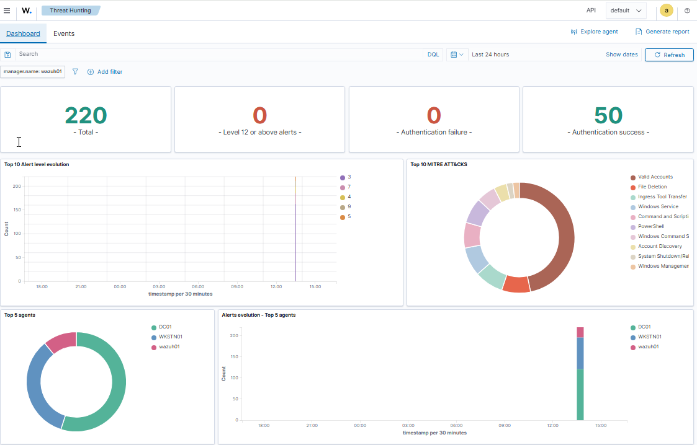
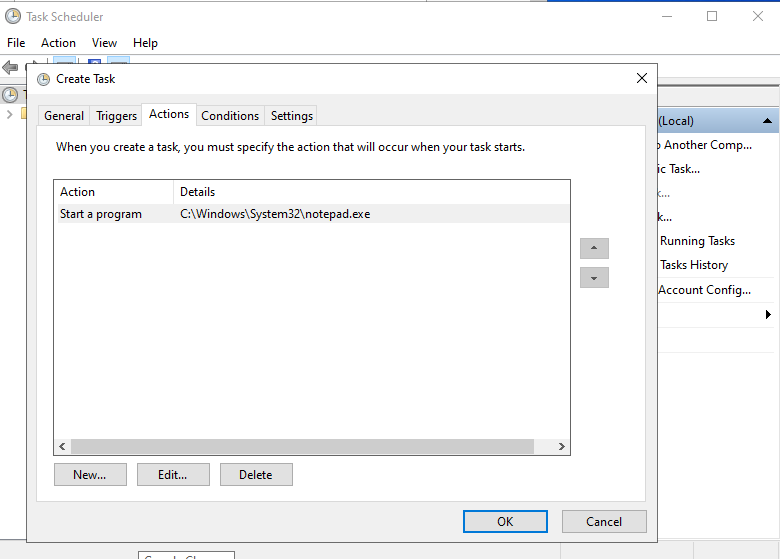
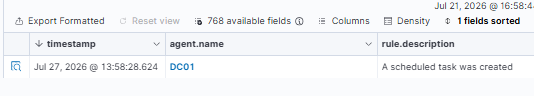
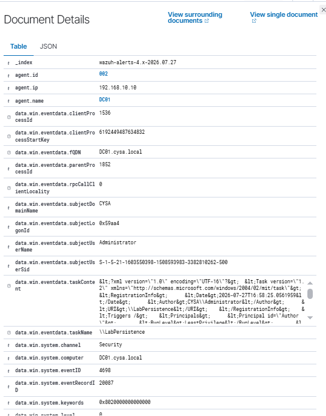
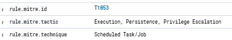

# Lab 03 – Scheduled Task Investigation (Event ID 4698)

## Objective

The objective of this lab was to investigate the creation of a Windows Scheduled Task using Wazuh SIEM. During the lab, I also identified and resolved a logging issue that prevented Event ID 4698 from being generated, demonstrating the importance of proper Windows audit policy configuration.

---

## Lab Environment

- Wazuh SIEM
- Windows Server 2022 Domain Controller (DC01)
- Windows Task Scheduler
- Windows Event Viewer
- Group Policy Management

---

## Scenario

Scheduled tasks are commonly used by system administrators to automate tasks, but attackers also use them as a persistence technique after compromising a system. In this lab, I created a scheduled task named **LabPersistenceTest** to simulate potential persistence activity and investigated how Wazuh detected the event.

---

## Investigation Steps

1. Opened the Wazuh Threat Hunting dashboard.
2. Created a scheduled task named **LabPersistenceTest** that launched **Notepad.exe**.
3. Searched Wazuh for Event ID 4698 but no events were detected.
4. Verified that Windows Event Viewer was not generating Event ID 4698.
5. Identified that **Audit Other Object Access Events** was not configured.
6. Enabled auditing through Group Policy.
7. Applied the new policy using **gpupdate /force**.
8. Recreated the scheduled task.
9. Confirmed Wazuh successfully detected the scheduled task creation event.
10. Reviewed the event details and MITRE ATT&CK mapping.

---

## Findings

- **Alert:** A scheduled task was created
- **Event ID:** 4698
- **Host:** DC01
- **Task Name:** LabPersistenceTest
- **Program:** Notepad.exe
- **Detection Platform:** Wazuh SIEM

---

## MITRE ATT&CK Mapping

**Technique:** T1053.005 – Scheduled Task/Job: Scheduled Task

Attackers frequently create scheduled tasks to establish persistence or execute malicious programs automatically. Monitoring Event ID 4698 helps identify this behavior early.

---

## Analyst Conclusion

This lab demonstrated that successful threat detection depends on proper logging configuration. Initially, Wazuh did not detect the scheduled task because Windows was not generating Security Event ID 4698. After enabling the appropriate Windows audit policy and updating Group Policy, Wazuh successfully detected the scheduled task creation event.

This exercise reinforced the importance of validating both Windows logging and SIEM visibility during security investigations.

---

## Screenshots

### 01 – Threat Hunting Home

### 02 – Created Scheduled Task

### 03 – Scheduled Task Detected

### 04 – Wazuh Event 4698 Details

### 05 – MITRE ATT&CK Mapping

---

## Skills Demonstrated

- Wazuh Threat Hunting
- Windows Event Log Analysis
- Event ID 4698 Investigation
- Windows Task Scheduler
- Windows Group Policy
- Windows Audit Policy Configuration
- SIEM Detection Validation
- MITRE ATT&CK Mapping
- Security Investigation
- SOC Analyst Workflow
