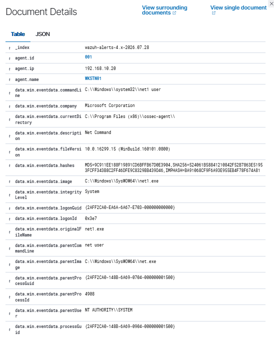
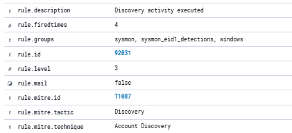
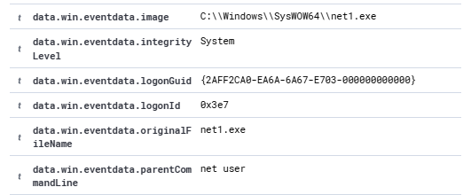
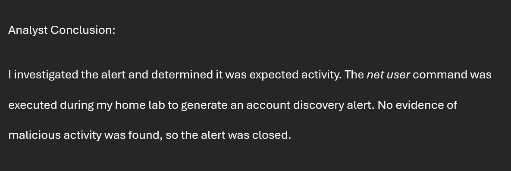

# SOC Lab 04 – Windows Discovery Activity Investigation

## Objective

Investigate a Wazuh alert generated by Windows account discovery activity and determine whether the activity was legitimate or suspicious.

---

## Lab Environment

- Wazuh SIEM v4.14.6
- Windows 10 Workstation
- Windows Server 2022 Domain Controller
- VirtualBox
- MITRE ATT&CK Framework

---

## Attack Scenario

As part of a simulated SOC investigation, the Windows `net user` command was intentionally executed on the Windows workstation to enumerate local user accounts. Wazuh detected the activity and generated a **Discovery activity executed** alert. The investigation focused on identifying the process responsible, reviewing the command that was executed, mapping the activity to MITRE ATT&CK, and determining whether the activity required escalation.

---

## Investigation Process

1. Opened the Wazuh Threat Hunting dashboard.
2. Located the **Discovery activity executed** alert.
3. Opened the alert details.
4. Reviewed the process information.
5. Confirmed the process executed was **net1.exe**.
6. Verified the command executed was **net user**.
7. Reviewed the MITRE ATT&CK mapping.
8. Determined the activity matched the expected lab scenario.

---

## Findings

- Wazuh detected a **Discovery activity executed** alert.
- The process executed was **net1.exe**.
- The command executed was **net user**.
- The activity mapped to **MITRE ATT&CK Technique T1087 – Account Discovery**.
- The activity matched the expected lab scenario and was authorized.

---

## MITRE ATT&CK

**Technique**

- T1087 – Account Discovery

**Tactic**

- Discovery

---

## Investigation Screenshots

### 1. Wazuh Threat Hunting Dashboard

### 2. Discovery Activity Alert

### 3. MITRE ATT&CK Mapping

### 4. Command Details

### 5. Analyst Conclusion

---

## Skills Demonstrated

- SIEM Investigation
- Windows Event Analysis
- Process Investigation
- Threat Hunting
- MITRE ATT&CK Mapping
- Incident Documentation

---

## Outcome

Successfully investigated and documented a Windows discovery activity alert using Wazuh SIEM. The investigation confirmed that the **net user** command was intentionally executed during a controlled home lab exercise to enumerate local user accounts. The alert was validated as expected administrative activity, mapped to **MITRE ATT&CK T1087 – Account Discovery**, and required no further escalation.
