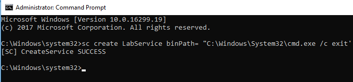
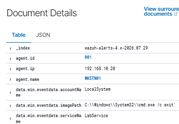
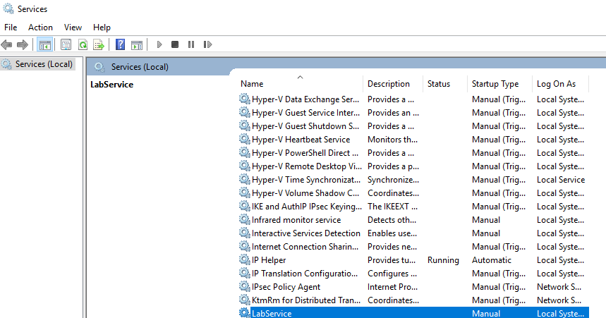

# SOC Lab 05 – Windows Service Installation Investigation

## Objective

Investigate a Windows Service Installation event (Event ID 7045) generated in Wazuh SIEM and determine whether the activity was legitimate or suspicious.

---

## Lab Environment

- Wazuh SIEM v4.14.6
- Windows 10 Workstation
- Windows Server 2022 Domain Controller
- VirtualBox
- MITRE ATT&CK Framework

---

## Attack Scenario

As part of a simulated SOC investigation, I intentionally created a Windows service on the Windows workstation to generate Windows Security Event ID 7045. Wazuh detected the service installation, and the investigation focused on identifying the newly installed service, reviewing its details, verifying it on the endpoint, and determining whether the activity was authorized.

---

## Investigation Process

1. Created a Windows service using the `sc create` command.
2. Opened Wazuh and located the Event ID 7045 alert.
3. Reviewed the event details.
4. Identified the newly installed service (**LabService**).
5. Verified the service details, including the service name, image path, and account.
6. Confirmed the service existed on the Windows endpoint using the Services console.
7. Determined the activity matched the expected lab scenario.

---

## Findings

- Windows Service Installation Event ID 7045 was detected.
- The newly installed service was **LabService**.
- The service image path was successfully identified.
- The service was verified on the Windows endpoint.
- The activity matched the expected lab scenario and was authorized.

---

## MITRE ATT&CK

**Technique**

- T1543.003 – Create or Modify System Process: Windows Service

**Tactic**

- Persistence

---

## Investigation Screenshots

### 1. Service Creation Command

### 2. Wazuh Event ID 7045 Details

### 3. Service Details

### 4. Services Console Verification

---

## Skills Demonstrated

- SIEM Investigation
- Windows Event Log Analysis
- Windows Service Investigation
- Endpoint Verification
- MITRE ATT&CK Mapping
- Incident Documentation

---

## Outcome

I investigated a Windows Service Installation event (Event ID 7045) in Wazuh SIEM. I intentionally created a Windows service during my home lab to generate the event, then investigated the alert to verify the service details in Wazuh and on the endpoint. Based on my investigation, I determined the activity matched the expected lab scenario and was legitimate administrative behavior.
