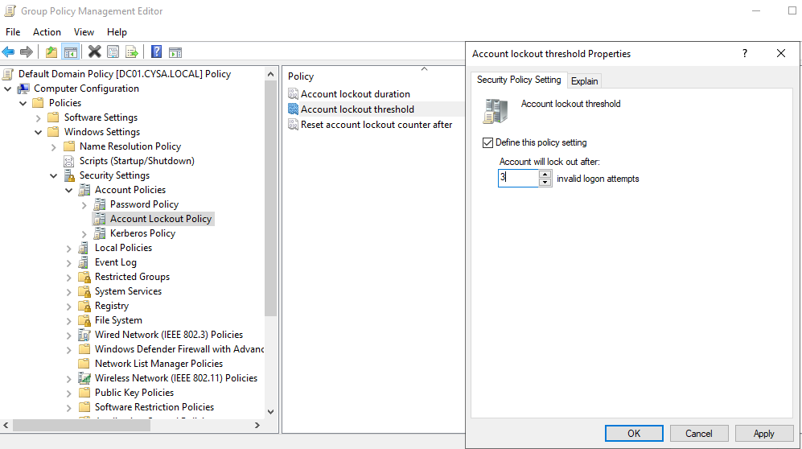
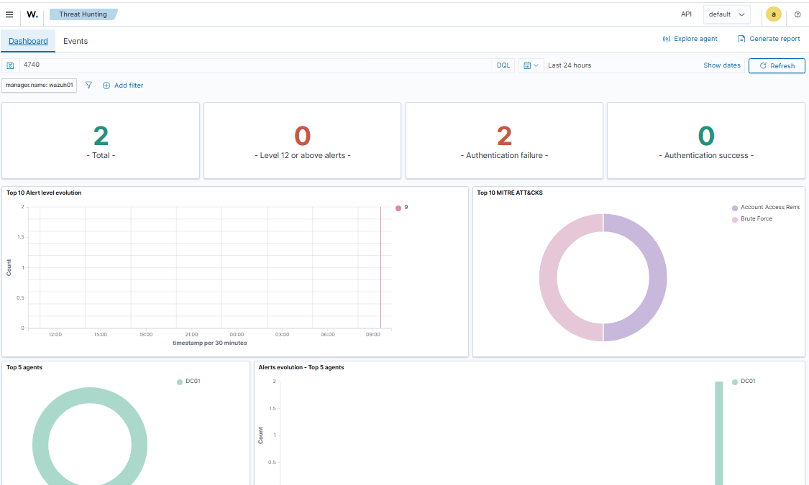

# Lab 06 – Account Lockout Investigation

## Objective

The objective of this lab was to configure a Windows Account Lockout Policy, enable the required Advanced Audit Policies, generate an account lockout, and investigate the resulting Event ID 4740 in both Windows Event Viewer and Wazuh SIEM.

---

## Lab Environment

- **SIEM:** Wazuh
- **Domain Controller:** Windows Server 2022 (DC01)
- **Workstation:** Windows 10
- **Directory Service:** Active Directory
- **Domain:** CYSA.local

---

## Attack Scenario

A Windows Account Lockout Policy was configured in the domain and Advanced Audit Policies were enabled to ensure account lockout events were logged. Multiple failed login attempts were then performed against a domain user account from a Windows workstation until the account became locked. The resulting security event was investigated in both Windows Event Viewer and Wazuh SIEM.

---

## Investigation Process

- Configured the Windows Account Lockout Policy.
- Enabled Advanced Audit Policies required for account lockout logging.
- Applied the updated Group Policy.
- Generated multiple failed logon attempts against a domain user account.
- Confirmed the account was locked.
- Verified Event ID 4740 in Windows Event Viewer.
- Investigated the alert in Wazuh SIEM.
- Verified the locked account and identified the source workstation responsible for the failed logon attempts.

---

## Findings

- Windows successfully generated Event ID 4740.
- The account lockout policy functioned as expected.
- Wazuh successfully ingested the security event.
- The investigation identified both the locked user account and the originating workstation.
- The SIEM correlated the event and generated an account lockout alert.

---

## Investigation Screenshots

### 1. Configure Account Lockout Policy

### 2. Enable Account Lockout Auditing

### 3. Account Locked Out

### 4. Wazuh Threat Hunting Dashboard

### 5. Verified Locked-Out User and Source Workstation

---

## Skills Demonstrated

- Active Directory Administration
- Group Policy Configuration
- Windows Advanced Audit Policy Configuration
- Windows Event Viewer Investigation
- Account Lockout Analysis
- Wazuh SIEM Investigation
- Security Event Analysis
- SOC Investigation Workflow

---

## Outcome

I successfully configured Windows Account Lockout and Advanced Audit Policies to generate Event ID 4740. After producing multiple failed logon attempts, I verified the account lockout in Windows Event Viewer and confirmed the event was ingested into Wazuh SIEM. During the investigation, I identified both the locked user account and the source workstation, demonstrating the complete process of configuring, generating, and investigating an account lockout event in a SOC home lab.
