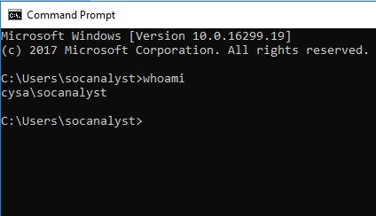
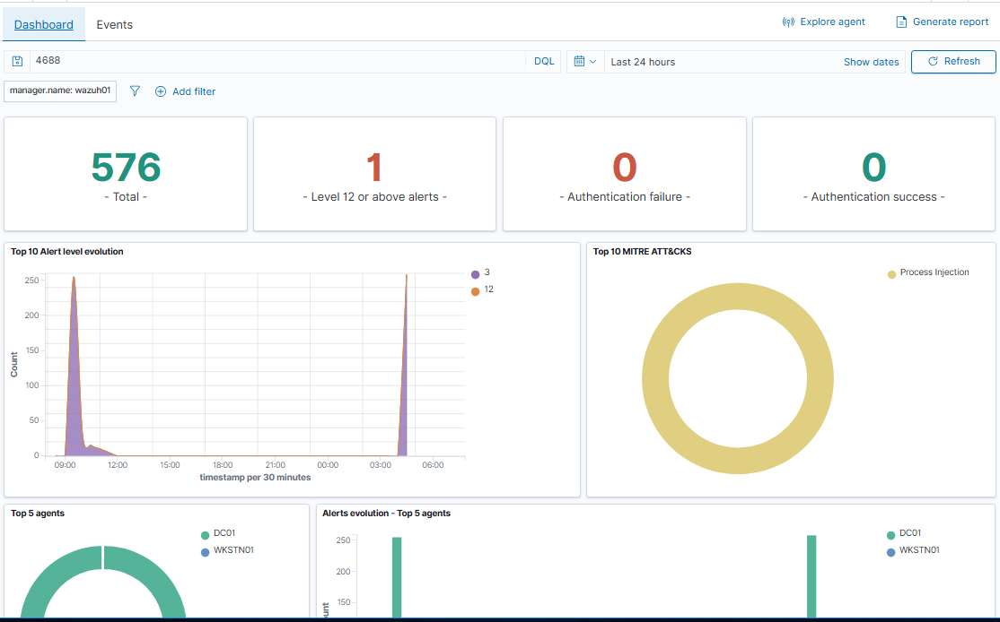
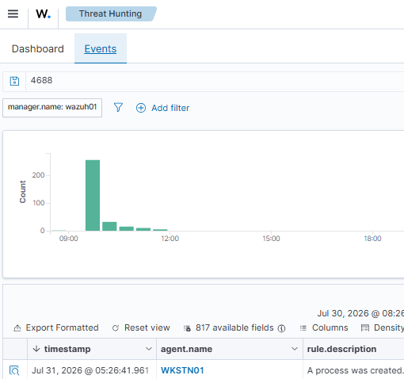
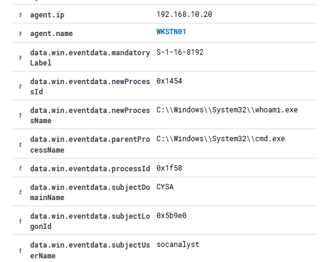

# Lab 07 – Windows Process Creation Investigation

## Objective

Investigate a Windows Process Creation event (Event ID 4688) in Wazuh SIEM by generating a process from a Windows workstation and verifying the originating endpoint, user, and process details.

---

## Lab Environment

- Wazuh SIEM
- Windows Server 2022 Domain Controller (DC01)
- Windows 10 Workstation (WKSTN01)
- Active Directory
- Windows Event Forwarding (WEF)

---

## Attack Scenario

To simulate a Windows process creation event, I logged into WKSTN01 using the SOCAnalyst account and executed the `whoami` command from Command Prompt. This generated Windows Security Event ID 4688, which was forwarded to Wazuh SIEM for investigation.

---

## Investigation Process

- Logged into WKSTN01 as the SOCAnalyst user.
- Executed the `whoami` command from Command Prompt.
- Located Event ID 4688 in Wazuh Threat Hunting.
- Reviewed the alert details to identify the originating workstation, user account, executed process, and parent process.
- Verified that the alert matched the activity generated during the lab.

---

## Findings

The investigation confirmed:

- Event ID: 4688 (Process Creation)
- Source Workstation: WKSTN01
- User Account: SOCAnalyst
- Executed Process: whoami.exe
- Parent Process: cmd.exe

The Wazuh alert successfully identified the endpoint, user, and process responsible for the event.

---

## MITRE ATT&CK

**T1059 – Command and Scripting Interpreter**

---

## Investigation Screenshots

### 1. Whoami Command Executed

---

### 2. Wazuh Threat Hunting Dashboard

---

### 3. Process Creation Alert (Event ID 4688)

---

### 4. Verified Process, User, and Workstation

---

## Skills Demonstrated

- Windows Security Event Analysis
- Windows Process Creation Investigation
- Wazuh SIEM Investigation
- Event ID 4688 Analysis
- Endpoint Attribution
- Threat Hunting
- Windows Event Forwarding (WEF)
- SOC Investigation Workflow

---

## Outcome

I investigated a Windows Process Creation event (Event ID 4688) in my Wazuh SIEM home lab. After executing the `whoami` command on WKSTN01 as the SOCAnalyst user, I verified the alert in Wazuh and confirmed the originating workstation, executed process (`whoami.exe`), and parent process (`cmd.exe`). Based on my investigation, I determined the activity matched the expected lab scenario and represented legitimate administrative behavior.
