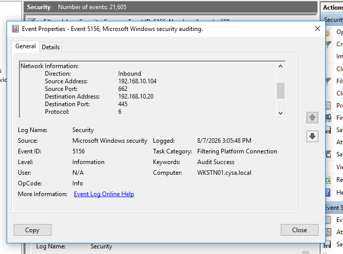
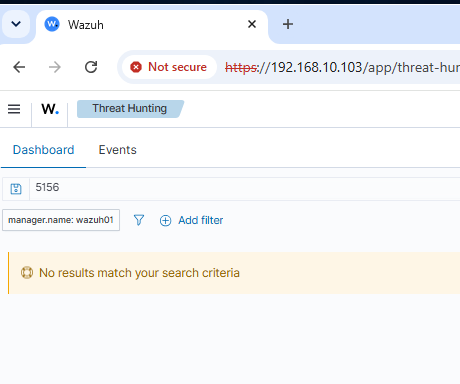

# Lab 10: Nmap Network Reconnaissance Investigation

## Objective

Perform network reconnaissance from a Kali Linux attacker machine against a Windows workstation and investigate the resulting activity from the Blue Team perspective.

The goal of this lab was to use Nmap to identify exposed services on the Windows endpoint, validate the network activity through Windows Security logs, and determine whether the corresponding event was visible within Wazuh.

---

## Lab Environment

- Kali Linux – Attacker
- Windows 10 – WKSTN01
- Wazuh SIEM
- Windows Event Viewer
- Nmap

---

## Red Team Activity

### Nmap Service Scan

An Nmap service/version scan was performed from Kali Linux against the Windows workstation at `192.168.10.20`.

Command used:

```bash
nmap -sV 192.168.10.20
```

The scan confirmed that the target was online and identified three open TCP ports:

- TCP 135 – Microsoft RPC
- TCP 139 – NetBIOS Session Service
- TCP 445 – Microsoft SMB

The remaining 997 scanned TCP ports were reported as closed.

This reconnaissance demonstrated how an attacker can identify exposed network services before attempting additional enumeration or exploitation.

### Evidence


---

## Blue Team Investigation

### Windows Network Connection Analysis

After completing the Nmap scan, Windows Security logs on WKSTN01 were reviewed for evidence of network activity originating from the Kali Linux attacker machine.

Windows Security Event ID 5156 was identified.

Event ID 5156 represents a connection permitted by the Windows Filtering Platform.

The event contained the following network information:

- Event ID: 5156
- Direction: Inbound
- Source IP: `192.168.10.104`
- Source System: Kali Linux
- Destination IP: `192.168.10.20`
- Destination System: WKSTN01
- Destination Port: `445`
- Protocol: TCP

The source IP matched the Kali Linux attacker machine and the destination port matched SMB, one of the services discovered during the Nmap scan.

This provided endpoint evidence of network activity between Kali Linux and the Windows workstation.

### Evidence



---

## Wazuh SIEM Investigation

After confirming Event ID 5156 locally in Windows Event Viewer, Wazuh Threat Hunting was searched for the same event.

A search for:

```text
5156
```

returned:

```text
No results match your search criteria
```

The Windows endpoint therefore contained Event ID 5156 locally, but the event was not found in Wazuh during this investigation.

### Evidence



---

## Detection Gap Identified

The investigation identified a potential SIEM visibility gap.

Windows successfully recorded network activity involving the Kali Linux attacker machine through Security Event ID 5156. However, the corresponding event could not be located within Wazuh.

The investigation did not determine the exact cause of the missing event.

A future lab will investigate the Windows audit policy and Wazuh Windows Security event collection configuration to determine why Event ID 5156 was not available within the SIEM.

---

## Investigation Findings

The investigation established the following sequence of activity:

1. Kali Linux performed an Nmap service scan against WKSTN01.
2. Nmap discovered TCP ports 135, 139, and 445.
3. Windows Security logging recorded network activity from the Kali Linux source IP.
4. Windows Event ID 5156 showed traffic involving TCP port 445.
5. Wazuh was searched for Event ID 5156.
6. No corresponding Event ID 5156 results were found in Wazuh.
7. A potential SIEM visibility gap was documented for future investigation.

---

## MITRE ATT&CK Mapping

The reconnaissance activity demonstrated behavior associated with:

**T1046 – Network Service Scanning**

Network service scanning is commonly used to identify systems and exposed services that may be targeted during later stages of an intrusion.

---

## Conclusion

The Nmap reconnaissance was authorized activity performed within the SOC home lab.

From the Red Team perspective, Kali Linux successfully performed network service discovery against the Windows workstation and identified several exposed Windows services, including SMB on TCP port 445.

From the Blue Team perspective, Windows Security Event ID 5156 provided evidence of network activity originating from the Kali Linux attacker machine and targeting the Windows workstation.

The investigation also identified a potential monitoring gap because Event ID 5156 was not found within Wazuh.

Rather than assuming the event was not ingested, the missing SIEM visibility was documented for additional troubleshooting in a future lab.

No unauthorized compromise occurred.

---

## Skills Demonstrated

- Kali Linux
- Nmap
- Network Reconnaissance
- Network Service Scanning
- Service Enumeration
- Red Team / Blue Team Analysis
- Windows Security Log Analysis
- Windows Event ID 5156
- Windows Filtering Platform Analysis
- SMB Traffic Analysis
- Wazuh Threat Hunting
- SIEM Visibility Gap Identification
- MITRE ATT&CK T1046
- SOC Investigation
